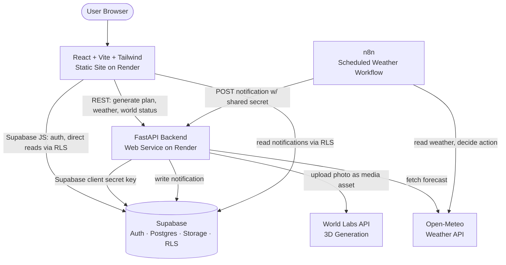
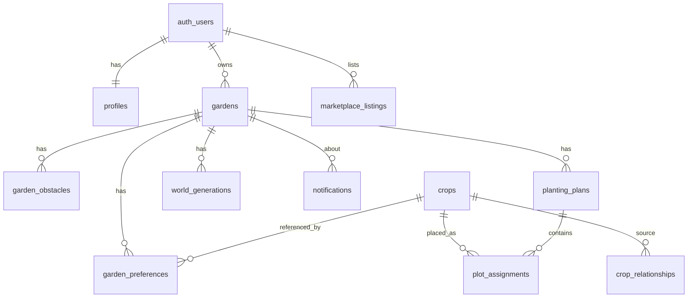

# Sprout: IMPLEMENTATION.md

A hackathon build plan for **Sprout**, an app that turns a yard, balcony, raised bed, or community plot into a season-long food garden with succession planting.

This document is written to be executed directly by coding agents and a four-person team. It favors demo reliability and integration speed over production infrastructure.

> **⚠ Architecture superseded — backend is now n8n + Supabase.** The live backend
> has **no custom API server** and **uses no external APIs**: automation runs on a
> hosted n8n instance backed by Supabase, and the frontend only (1) POSTs JSON to
> n8n webhooks and (2) reads Supabase tables directly. The FastAPI-based sections of
> this plan — **§5 Architecture, §6 Responsibilities, §12 Endpoints, §18/§18b, §20
> Deployment, §21 Environment** — describe an earlier implementation and are
> superseded by **[`docs/backend.md`](./docs/backend.md)**, the authoritative backend
> reference (all workflows, webhook paths, request bodies, tables, and the frontend
> integration contract). The `backend/` FastAPI folder is legacy and not deployed.
> The rest of this document (data model, optimizer heuristic, plan/grid UI, crop
> data) still reflects the app.

> **Status (built & deployed).** The core flow is live on Render — frontend
> https://sprout-1-qckn.onrender.com, backend https://sprout-ldna.onrender.com.
> Some decisions changed during the build; the most important divergences from
> the original plan are called out in **§0. What changed since planning** below,
> and the affected sections have been updated in place.

---

## 0. What changed since planning

- **World Labs is real, not a fallback.** The 3D preview now generates an actual
  Marble world from the garden photo + planned crops and renders the returned
  Gaussian-splat scene in-app with [Spark](https://sparkjs.dev/) (three.js). The
  previously planned checked-in "demo world" was removed entirely — there is no
  fallback world; a failed generation shows an error with a retry and an
  "open in Marble" link. `MOCK_WORLD_LABS=false` is the real path and the default
  for deployment. See §18.
- **The app fails fast on missing config** instead of running against placeholders.
  The frontend throws at startup without `VITE_SUPABASE_*`; the plan page shows a
  real error instead of a hard-coded sample plan.
- **Garden deletion** shipped: `DELETE /api/gardens/{id}` plus a two-step confirm
  on the dashboard.
- **Notification fallback**: the panel shows a few built-in notifications when the
  notifications API is unreachable, so it is never blank/broken.
- **Plan grid** shows the space each plan occupies with a dashed cell overlay and
  each crop block labelled with its real-world size.
- **Marketplace shipped** (was P2 "first to cut"): list surplus crops to
  sell/trade/give away, browse other growers' listings by crop + city, and reserve
  an item (seller notified; handoff offline). See §12 and §18b.
- **UI**: a hero-image landing page, pill buttons and the garden hero carried into
  the auth pages, a dashboard "impact summary" section, and a centered top nav
  (Garden · Marketplace) on the signed-in pages.

---

## 1. Executive Summary

Sprout takes a garden's dimensions, sunlight level, and a list of vegetables the user eats, then produces an optimized season-long planting plan. The plan reuses each garden section over time (succession planting): lettuce in the spring bed gets replaced by beans in summer. The plan renders on a grid with a timeline slider, so moving from June to July visibly swaps one crop for its successor. Sprout also estimates seasonal yield and grocery savings as ranges, generates a real 3D preview of the garden via the World Labs Marble API (rendered in-app as a Gaussian-splat scene), and fires one n8n weather workflow that writes a watering or frost notification back into the app.

The build is one React/Vite frontend, one FastAPI backend, Supabase for auth/database/storage, one n8n workflow, and World Labs for the 3D preview. No microservices, no Redis, no separate auth system. The optimizer is a two-stage heuristic that runs inside a single API request.

The single most important deliverable is the end-to-end flow: sign up, create a garden, enter dimensions, pick crops, generate a plan, scrub the timeline, watch a crop hand off to its successor, and see yield/savings. Everything else is secondary to that flow working on stage.

---

## 2. Repository Assessment

**Current state: empty repository.** At the time this plan was written, the working environment contained no existing Sprout code, no `package.json`, no `requirements.txt`, no Supabase config, and no prior `IMPLEMENTATION.md`. There is nothing to preserve and nothing to migrate.

Consequences for the plan:

- All scaffolding is greenfield. Follow the repository structure in Section 7 exactly; there is no legacy layout to adapt around.
- Every technology choice defaults to the required stack in the brief, since no existing alternative is present.
- The first task for Person 1 and Person 2 is to scaffold `frontend/` and `backend/` respectively so other work has a place to land.

If you are reading this inside a repo that already has code, stop and reconcile: keep working code, and treat the file paths below as targets rather than overwrites.

---

## 3. Hackathon Scope

**In scope (P0):** Supabase email/password auth, garden creation with dimensions and sunlight, curated crop dataset, crop selection, the space-and-time optimizer with succession planting, the grid + timeline plan view, yield and savings estimates, one n8n weather workflow, a real World Labs Marble 3D preview, and Render deployment of both services.

**Valuable if time allows (P1):** obstacle placement, multiple saved gardens, richer placement explanations, notification history, mobile polish. *(Real World Labs generation and garden delete shipped.)*

**Mock or demo-only (P2):** companion-plant visual explanations. *(The crop marketplace — list/browse/reserve surplus — was originally P2 but is now built; see §12 and §18b.)*

**Out of scope:** Redis, Auth0, ElevenLabs, payments, delivery, real-time chat, pixel-perfect measurement from photos, CV model training, native mobile, full social features, marketplace moderation, city-wide coordination, microservices, Kubernetes, scraping pipelines.

See Section 25 for the ordered checklist that turns this into work.

---

## 4. User Journey

1. User lands on the marketing page and clicks Get Started.
2. User signs up with email and password (Supabase Auth). A `profiles` row is created.
3. User logs in and reaches the dashboard.
4. User starts the create-garden wizard: names the garden, sets city, enters width and length in meters, picks a sunlight level, and uploads a garden photo.
5. The photo goes to Supabase Storage under `user-id/garden-id/`. The dimensions are stored separately and are what the optimizer uses.
6. User picks vegetables from the curated list and marks any as must-have.
7. User clicks Generate Plan. The backend runs the optimizer in one request and stores a plan plus its plot assignments.
8. The plan page renders the grid, a legend, and a timeline slider.
9. User drags the timeline. Crops appear on their plant dates and disappear on their removal dates. Successor crops take over vacated cells.
10. User reads the estimated yield range and grocery-savings range, plus a per-placement explanation.
11. User opens the 3D preview. The backend generates a Marble world from the garden photo and planned crops; the frontend polls status and renders the returned Gaussian-splat world in-app, with a link out to the full hosted world. A failed generation shows an error with a retry.
12. In the background, the n8n weather workflow runs, decides an action is needed, and posts a notification. It shows up in the dashboard notification panel.

---

## 5. Simplified Architecture

> **Superseded** — the live architecture is n8n + Supabase with no custom API
> server; see [`docs/backend.md`](./docs/backend.md). The diagram below is the
> earlier FastAPI design.



Key decisions baked into this diagram:

- The frontend talks to Supabase **directly** for auth and for simple reads/writes that RLS can protect (profiles, gardens list, notifications). It talks to the **backend** only for work that needs server logic or secrets: plan generation, weather proxying, World Labs.
- The backend holds the Supabase **secret key** and the World Labs key. Neither ever reaches the browser.
- n8n runs independently on a schedule. It calls the backend webhook with a shared secret. The backend is the only writer of n8n-originated notifications.

---

## 6. Technology Responsibilities

| Concern | Owner | Notes |
|---|---|---|
| Auth (signup, login, logout, session, reset) | Supabase Auth | No custom password handling, ever |
| Relational data | Supabase Postgres | Accessed via Supabase client, not SQLAlchemy |
| Row-level access control | Supabase RLS | Policies in `supabase/rls-policies.sql` |
| Image storage | Supabase Storage | One bucket, `garden-images` |
| Plan generation / optimization | FastAPI `services/optimizer.py` | Two-stage heuristic, one request |
| Yield & savings math | FastAPI `services/estimates.py` | Transparent formulas, ranges only |
| Weather fetch | FastAPI `services/weather.py` + Open-Meteo | Mockable via `MOCK_WEATHER` |
| 3D preview | World Labs Marble via `services/world_labs.py`; rendered in-app with Spark/three.js | Real generation; `MOCK_WORLD_LABS` skips it (no demo world) |
| Scheduled reminders | n8n | One polished weather workflow |
| Hosting | Render | Static site + web service only |

Database access uses the **Supabase client only**. Do not add SQLAlchemy or `SUPABASE_DB_URL` unless a task genuinely cannot be done through the client. Maintaining two data-access paths is the kind of overhead this hackathon does not have time for.

---

## 7. Repository Structure

```text
sprout/
├── frontend/
│   ├── src/
│   │   ├── components/          # shared UI: buttons, layout, grid cell, slider
│   │   ├── pages/              # Landing, Login, Signup, Dashboard, Wizard, Crops, Plan
│   │   ├── features/
│   │   │   ├── auth/           # session context, guards, forms
│   │   │   ├── gardens/        # wizard steps, garden API calls
│   │   │   ├── plans/          # grid, timeline, plan fetch, date filtering
│   │   │   ├── notifications/  # panel, list, mark-read
│   │   │   └── marketplace/    # P2, mock ok
│   │   ├── lib/
│   │   │   ├── supabase.ts     # createClient with publishable key
│   │   │   └── api.ts          # typed fetch wrapper to FastAPI
│   │   └── types/              # shared TS types incl. plan/assignment shapes
│   ├── .env.example
│   ├── index.html
│   ├── package.json
│   ├── tailwind.config.js
│   └── vite.config.ts
├── backend/
│   ├── app/
│   │   ├── main.py             # FastAPI app, CORS, router mounting
│   │   ├── config.py           # pydantic-settings, env vars
│   │   ├── auth.py             # verify Supabase JWT, current_user dep
│   │   ├── models/             # pydantic request/response models
│   │   ├── routes/             # gardens, crops, plans, weather, world, marketplace
│   │   ├── services/
│   │   │   ├── optimizer.py    # two-stage heuristic
│   │   │   ├── weather.py      # Open-Meteo + mock
│   │   │   ├── world_labs.py   # World Labs + mock
│   │   │   └── estimates.py    # yield & savings
│   │   └── data/
│   │       └── crop_seed_data.json
│   ├── tests/
│   ├── .env.example
│   └── requirements.txt
├── supabase/
│   ├── migrations/             # SQL for tables
│   ├── seed.sql                # crops + relationships from crop_seed_data.json
│   └── rls-policies.sql
├── n8n/
│   └── weather-workflow.json
├── docs/
└── IMPLEMENTATION.md
```

---

## 8. Supabase Authentication

Supabase Auth owns all credentials. Application tables never store passwords.

**Frontend flow (`features/auth/`):**

- `supabase.auth.signUp({ email, password })` on the signup page.
- `supabase.auth.signInWithPassword({ email, password })` on login.
- `supabase.auth.signOut()` on logout.
- `supabase.auth.getSession()` on app load to restore session, plus `supabase.auth.onAuthStateChange` to keep a React context in sync.
- Password reset (P1): `supabase.auth.resetPasswordForEmail(email)`.

**Profile creation:** After first signup, create a `profiles` row keyed to `auth.users.id`. Do this with a Postgres trigger so it cannot be skipped:

```sql
create function public.handle_new_user()
returns trigger language plpgsql security definer as $$
begin
  insert into public.profiles (id, display_name)
  values (new.id, coalesce(new.raw_user_meta_data->>'display_name', split_part(new.email,'@',1)));
  return new;
end; $$;

create trigger on_auth_user_created
  after insert on auth.users
  for each row execute procedure public.handle_new_user();
```

**Backend verification (`app/auth.py`):** The frontend sends the Supabase access token as `Authorization: Bearer <token>`. The backend verifies it against Supabase's JWKS (`SUPABASE_JWKS_URL`) and extracts the user ID. Provide a `current_user` FastAPI dependency that returns the user ID or raises 401. Do not write a custom JWT parser if a maintained library handles verification; keep it to a small dependency function.

---

## 9. Database Schema

Small schema. Only demo tables. Access via the Supabase client.



Tables and key columns:

- **`profiles`**: `id` (FK `auth.users.id`, PK), `display_name`, `city`, `created_at`.
- **`gardens`**: `id`, `user_id`, `name`, `city`, `latitude`, `longitude` (nullable, only if weather needs them), `width_m`, `length_m`, `sunlight_level`, `image_path`, `created_at`, `updated_at`.
- **`garden_obstacles`**: `id`, `garden_id`, `x`, `y`, `width_cells`, `height_cells`.
- **`crops`**: `id`, `name`, `spacing_cm`, `days_to_maturity`, `harvest_duration_days`, `sunlight_requirement`, `height_cm`, `minimum_yield_kg`, `maximum_yield_kg`, `estimated_price_per_kg`, `planting_month_start`, `planting_month_end`, `difficulty`.
- **`crop_relationships`**: `id`, `crop_id`, `related_crop_id`, `relationship_type` (`companion` | `conflict`), `score`.
- **`garden_preferences`**: `id`, `garden_id`, `crop_id`, `priority` (`must_have` | `preferred` | `optional`).
- **`planting_plans`**: `id`, `garden_id`, `status`, `estimated_minimum_yield_kg`, `estimated_maximum_yield_kg`, `estimated_minimum_savings`, `estimated_maximum_savings`, `created_at`.
- **`plot_assignments`**: `id`, `plan_id`, `crop_id`, `x`, `y`, `width_cells`, `height_cells`, `plant_date`, `harvest_start`, `harvest_end`, `plant_count`, `estimated_minimum_yield_kg`, `estimated_maximum_yield_kg`, `successor_assignment_id` (nullable self-FK), `explanation`.
- **`notifications`**: `id`, `user_id`, `garden_id`, `type`, `title`, `message`, `is_read`, `created_at`.
- **`world_generations`**: `id`, `garden_id`, `operation_id`, `world_id`, `status`, `result_url`, `error_message`, `created_at`, `updated_at`.
- **`marketplace_listings`**: `id`, `user_id`, `crop_id` (nullable FK to `crops`; null = free-text "other" in `title`), `title`, `exchange_type` (`sell`|`trade`|`free`), `price_per_unit`, `quantity`, `unit`, `city`, `description`, `status` (`draft`|`published`|`reserved`|`completed`|`archived`), `reserved_by` (FK to `auth.users`), `reserved_at`, `image_path`, `created_at`, `updated_at`. Added to the original stub by `migrations/0002_marketplace.sql`. (`category`/`approximate_area` are legacy, unused.)

Put each table in a migration under `supabase/migrations/`. Seed `crops` and `crop_relationships` from `seed.sql`.

---

## 10. Row Level Security

Enable RLS on every table with user data. Reference data (`crops`, `crop_relationships`) is readable by any authenticated user and writable by no one at runtime.

Policy summary:

- **profiles**: a user can `select` and `update` the row where `id = auth.uid()`.
- **gardens**: full `select/insert/update/delete` where `user_id = auth.uid()`.
- **garden_obstacles / garden_preferences / planting_plans / plot_assignments**: access allowed when the parent garden belongs to the user. For child tables, check ownership through the garden (a subquery on `gardens.user_id = auth.uid()`).
- **crops / crop_relationships**: `select` for `authenticated`; no write policy.
- **notifications**: a user can `select` and `update` (mark read) rows where `user_id = auth.uid()`. Inserts come from the backend using the secret key, which bypasses RLS.
- **world_generations**: access through the owning garden.
- **marketplace_listings** (P2): any authenticated user can `select` rows where `status = 'published'`; a user can `insert/update/delete` only rows where `user_id = auth.uid()`.

Example (gardens):

```sql
alter table public.gardens enable row level security;

create policy "own gardens - select" on public.gardens
  for select using (user_id = auth.uid());
create policy "own gardens - insert" on public.gardens
  for insert with check (user_id = auth.uid());
create policy "own gardens - modify" on public.gardens
  for update using (user_id = auth.uid());
create policy "own gardens - delete" on public.gardens
  for delete using (user_id = auth.uid());
```

Example (child through parent):

```sql
create policy "plans via garden" on public.planting_plans
  for select using (
    exists (select 1 from public.gardens g
            where g.id = planting_plans.garden_id and g.user_id = auth.uid())
  );
```

Keep it at this level. Do not build a role/permission matrix.

---

## 11. Supabase Storage

One bucket: **`garden-images`** (private).

- Authenticated users upload to a path prefixed with their user ID: `user-id/garden-id/original.jpg`.
- Storage RLS: a user can read/write objects whose path starts with their own `auth.uid()`. This keeps each user's originals private.
- For a 3D preview, the backend downloads the stored photo (secret key) and uploads it to World Labs Marble as a media asset — the image bytes go to Marble directly, not via a public URL.
- Validate before upload: allowed types `image/jpeg`, `image/png`, `image/webp`; max size 10 MB. Do the check on the client for UX and again on the backend for anything server-mediated.

Storage policy sketch:

```sql
create policy "own images" on storage.objects
  for all using (
    bucket_id = 'garden-images'
    and (storage.foldername(name))[1] = auth.uid()::text
  );
```

---

## 12. API Endpoints

> **Superseded.** These describe the legacy FastAPI server. The live backend
> exposes **n8n webhooks** and Supabase table reads instead — see
> [`docs/backend.md`](./docs/backend.md).

Base path `/api`. All non-public endpoints require `Authorization: Bearer <supabase_access_token>`. Errors use a consistent shape:

```json
{ "error": { "code": "not_found", "message": "Garden not found" } }
```

Common codes: `unauthorized` (401), `forbidden` (403), `not_found` (404), `validation_error` (422), `upstream_unavailable` (503).

### Gardens

- **`POST /api/gardens`**: create a garden.
  Auth: required. Body: `{ name, city, width_m, length_m, sunlight_level, latitude?, longitude? }`. Response: full garden object. Errors: 422 on bad dimensions.
- **`GET /api/gardens`**: list the user's gardens. Response: `[garden]`.
- **`GET /api/gardens/{garden_id}`**: one garden. 404 if not owned/found.
- **`PATCH /api/gardens/{garden_id}`**: update fields. Body: partial garden. 403 if not owner.
- **`DELETE /api/gardens/{garden_id}`**: delete a garden (owner-checked). 204 on success; related plans, obstacles, and world generations cascade at the DB level.
- **`POST /api/gardens/{garden_id}/obstacles`**: replace obstacle set. Body: `{ obstacles: [{x,y,width_cells,height_cells}] }`.

### Crops

- **`GET /api/crops`**: full curated list. Auth: required. Response: `[crop]`.
- **`GET /api/crops/{crop_id}`**: one crop.

### Plans

- **`POST /api/gardens/{garden_id}/plans/generate`**: run the optimizer.
  Body: `{ selections: [{ crop_id, priority }], grid_cell_cm?: 30 }`. Response: `{ plan, assignments }` (see example below). Runs synchronously in one request. Errors: 422 if no crops selected; 200 with an `unplaced` list and explanations if some crops did not fit.
- **`GET /api/plans/{plan_id}`**: fetch a stored plan with assignments for rendering.

### Weather

- **`GET /api/gardens/{garden_id}/weather`**: current + short forecast for the garden's location (proxied Open-Meteo, respects `MOCK_WEATHER`). Response: `{ current, daily[] }`.
- **`POST /api/webhooks/n8n/weather-notification`**: n8n calls this to create a notification.
  Auth: shared secret header `X-N8N-Secret` matching `N8N_WEBHOOK_SECRET` (not a user token). Body: `{ user_id, garden_id, type, title, message }`. Rejects with 401 on bad/missing secret.

### World Labs (Marble)

- **`POST /api/gardens/{garden_id}/world`**: start generation. Backend downloads the stored garden photo, uploads it to Marble as a media asset, starts a generation with an image + text prompt built from the plan's crops, stores a `world_generations` row with `operation_id`, returns `{ operation_id, status }`.
- **`GET /api/gardens/{garden_id}/world/status`**: poll. Returns `{ status, result_url?, error_message?, world_id? }`. `status` in `pending | processing | ready | failed`.
- **`GET /api/gardens/{garden_id}/world/assets`**: for a ready world, returns the splat scene URL(s), panorama URL, and scale metadata the in-app viewer needs.
- **`GET /api/gardens/{garden_id}/world/pano`**: same-origin proxy of the world's equirectangular panorama (avoids CORS for the WebGL texture), used as a fallback view.

### Marketplace

Backend-mediated (seller name/city come from `profiles`, which RLS hides from other users).

- **`POST /api/marketplace/listings`**: create a listing (owner = caller; status `published`; `city` defaults from the caller's profile; `sell` requires `price_per_unit`).
- **`GET /api/marketplace/listings`**: browse other users' published, unreserved listings — who you can buy from. Filters: `crop_id`, `city`, `exchange_type`. Returns seller name/city + crop name.
- **`GET /api/marketplace/listings/mine`**: the caller's listings (selling), any status, with reserver info.
- **`GET /api/marketplace/listings/reserved`**: listings the caller has reserved (buying).
- **`PATCH` / `DELETE /api/marketplace/listings/{id}`**: owner-checked edit/remove.
- **`POST /api/marketplace/listings/{id}/reserve`**: reserve a published listing (not your own, not already reserved); sets `reserved_by`/`status='reserved'` and writes a `marketplace_reserved` notification to the seller.
- **`DELETE /api/marketplace/listings/{id}/reserve`**: the reserver cancels; back to `published`.

**Plan response example:**

```json
{
  "plan": {
    "id": "3f1c...",
    "garden_id": "9ab2...",
    "status": "complete",
    "estimated_minimum_yield_kg": 31.0,
    "estimated_maximum_yield_kg": 52.0,
    "estimated_minimum_savings": 210.0,
    "estimated_maximum_savings": 320.0,
    "space_utilization": 0.86
  },
  "assignments": [
    {
      "id": "a1",
      "crop_id": "lettuce",
      "crop": "Lettuce",
      "x": 0, "y": 0, "width_cells": 2, "height_cells": 2,
      "plant_date": "2027-04-15",
      "harvest_start": "2027-06-01",
      "harvest_end": "2027-06-15",
      "plant_count": 4,
      "estimated_minimum_yield_kg": 1.5,
      "estimated_maximum_yield_kg": 2.5,
      "successor_assignment_id": "a2",
      "explanation": "Cool-season crop placed in a partial-sun corner; harvested before beans need the space."
    },
    {
      "id": "a2",
      "crop_id": "bush_beans",
      "crop": "Bush Beans",
      "x": 0, "y": 0, "width_cells": 2, "height_cells": 2,
      "plant_date": "2027-06-16",
      "harvest_start": "2027-08-01",
      "harvest_end": "2027-09-10",
      "plant_count": 6,
      "estimated_minimum_yield_kg": 2.0,
      "estimated_maximum_yield_kg": 3.5,
      "successor_assignment_id": null,
      "explanation": "Succeeds lettuce in the same cells once it is cleared in mid-June."
    }
  ],
  "unplaced": [
    { "crop_id": "watermelon", "reason": "Needs ~1.8 m2 per plant; garden too small. Try a compact cucumber instead." }
  ]
}
```

---

## 13. Optimization Algorithm

The optimizer is the technical centerpiece. It optimizes **space and time** together: two crops may share the same cells as long as their date ranges do not overlap. Run it as a two-stage heuristic inside one request. OR-Tools is optional and only worth it if a placement subproblem is cleaner as a constraint model and stays achievable; a heuristic is a fully acceptable, and probably faster, deliverable.

**Inputs:** garden width/length, grid-cell size, location, sunlight level, selected crops with priority, per-crop spacing, planting windows, days to maturity, harvest window, expected yield range, plant height, companion/conflict relationships, and the local growing season.

**Output per assignment:** crop, grid position, size in cells, plant date, harvest start/end, removal date, plant count, yield range, grocery-value range, successor crop (if any), and a short placement explanation.

### Grid construction

```text
function build_grid(width_m, length_m, cell_cm):
    cols = floor(width_m * 100 / cell_cm)
    rows = floor(length_m * 100 / cell_cm)
    grid = rows x cols, each cell holds a list of occupied [start,end] intervals
    mark obstacle cells as permanently occupied [season_start, season_end]
    return grid, rows, cols
```

### Spatial overlap check

```text
function rects_overlap(a, b):
    return not (a.x + a.w <= b.x or b.x + b.w <= a.x
             or a.y + a.h <= b.y or b.y + b.h <= a.y)
```

### Time overlap check

```text
function dates_overlap(a_start, a_end, b_start, b_end):
    return a_start <= b_end and b_start <= a_end
```

A candidate placement is valid only if, for every cell it would occupy, no existing interval overlaps its `[plant_date, removal_date]`.

### Placement duration

```text
plant_date      = earliest valid date in crop.planting_window within local season
harvest_start   = plant_date + crop.days_to_maturity
harvest_end     = harvest_start + crop.harvest_duration_days
removal_date    = harvest_end            # cells free the day after
cells_needed    = area_from_spacing(crop.spacing_cm, cell_cm)  # width x height in cells
plant_count     = cells covered / spacing footprint per plant
```

### Stage 1: must-have / primary placement

```text
function place_primary(grid, crops):
    must = sort(crops where priority == must_have, by area desc, then duration desc)
    for crop in must:
        pos = find_free_region(grid, cells_needed(crop),
                               window=[plant_date, removal_date],
                               respect=[sunlight, obstacles, boundary, spacing])
        if pos: reserve(grid, pos, [plant_date, removal_date]); record(assignment)
        else:   record_unplaced(crop, reason)   # e.g. too big for this garden
```

Large or slow crops go down first so they are not crowded out.

### Stage 2: space & succession filling

```text
function fill_and_succeed(grid, crops):
    windows = find_free_space_time(grid)          # (region, [available_from, available_to])
    candidates = crops where priority in {preferred, optional} + short-season successors
    for (region, avail) in windows sorted by (earliest available, largest area):
        best = null
        for crop in candidates that fit region and whose planting window intersects avail:
            s = score(crop, region, avail, grid)
            if s > best.score: best = (crop, placement)
        if best:
            reserve(grid, best.placement, [plant_date, removal_date])
            if best.placement follows a just-cleared crop in the same cells:
                link predecessor.successor_assignment_id = best.id
```

### Scoring

```text
score = w_yield   * normalized_expected_yield
      + w_pref    * priority_weight(crop)          # must_have > preferred > optional
      + w_compat  * companion_bonus(crop, neighbors) - conflict_penalty(crop, neighbors)
      + w_util    * space_time_utilization_gain
      + w_spread  * harvest_spread_bonus            # rewards filling gaps in the harvest calendar
      - w_shade   * shading_penalty(crop.height, southward_neighbors)
```

Suggested starting weights: yield 0.30, preference 0.25, compatibility 0.15, utilization 0.15, spread 0.10, shade 0.05. Tune on the demo garden.

### Impossible requests

Return a useful explanation rather than silently dropping a crop:

> "Watermelon was not included because the selected balcony is too small. Consider a compact cucumber variety instead."

Populate the `unplaced` array in the plan response with `{ crop_id, reason }`.

---

## 14. Succession-Planting Logic

Succession is what makes Sprout more than a static layout. It falls out of Stage 2: when a region's earliest availability is a crop's removal date, the successor is planted the next day in the same cells.

```text
function link_succession(predecessor, region, grid):
    free_from = predecessor.removal_date + 1 day
    for crop in successor_candidates(region, season_remaining_after(free_from)):
        if crop.days_to_maturity + crop.harvest_duration <= days_left_in_season(free_from):
            if fits(region, crop) and valid_window(crop, free_from):
                place crop at region with plant_date = free_from
                predecessor.successor_assignment_id = successor.id
                return successor
    return none
```

Rules the linker enforces:

- A successor's `plant_date` is strictly after the predecessor's `removal_date`.
- A successor must be able to mature and be harvested before the season ends.
- Prefer successors that are companions (or at least not conflicts) with adjacent standing crops.

This is exactly what the timeline visualizes: predecessor and successor share `x/y/width/height`, and the slider swaps which one is "active" based on the selected date.

---

## 15. Yield and Savings Calculations

Transparent formulas, ranges only, in `services/estimates.py`. Never present a single falsely precise number.

```text
plant_count       = cells_area / footprint_per_plant

minimum_yield_kg  = plant_count * crop.minimum_yield_kg_per_plant
maximum_yield_kg  = plant_count * crop.maximum_yield_kg_per_plant

minimum_savings   = minimum_yield_kg * crop.estimated_price_per_kg
maximum_savings   = maximum_yield_kg * crop.estimated_price_per_kg
```

Plan totals are the sums across all assignments. The frontend always labels these as estimates:

> "Based on typical growing conditions and estimated grocery prices."

Example plan-level line for the demo:

> "This garden could produce roughly 31 to 52 kg of food and replace about $210 to $320 of groceries this season."

---

## 16. Frontend Pages

**Required:**

1. **Landing**: full-bleed garden hero, pitch, Get Started button.
2. **Sign-up**: email/password over the garden hero, calls `signUp`, redirects to dashboard.
3. **Login**: email/password, calls `signInWithPassword`.
4. **Dashboard**: greeting + impact summary, list of gardens (each with a two-step delete), a Create Garden button, and the notification panel.
5. **Create-garden wizard**: steps: basics (name, city) → dimensions (width, length, sunlight) → photo upload. Writes garden + uploads image.
6. **Crop-selection**: grid of crop cards from `GET /api/crops`; toggle select, mark must-have.
7. **Planting-plan**: the main screen (Section 17).
8. **3D preview**: embedded in the plan page; polls world status, renders the generated Marble splat world in-app (panorama fallback, error + retry).
9. **Notification panel**: list, unread badges, mark-read; falls back to built-in notifications if the API is unreachable.

10. **Marketplace**: Browse (crop + city filters, Reserve), My listings (create form + delete), and Reserved tabs.

Signed-in pages share a centered top nav (Garden · Marketplace) via `components/AppHeader.tsx`. Guard all authed pages with a session check that redirects to login when there is no session.

---

## 17. Garden Grid and Timeline

The plan page is the demo. Build it to be legible from the back of a room.

Layout:

- **Grid**: a `rows x cols` CSS grid sized to the plan's occupied cells. A dashed cell overlay divides it, and each assignment renders as a colored block at its `x/y` spanning `width_cells x height_cells`, labeled with the crop name and its real-world size (cells × 30 cm).
- **Legend**: crop color/icon key.
- **Timeline slider**: ranges over the season (earliest plant date to latest harvest end). The label shows the selected date.
- **Active-crop filter**: an assignment is visible only when `plant_date <= selected_date <= removal_date`. This one predicate drives the whole animation.

```text
visible(assignment, selected_date) =
    assignment.plant_date <= selected_date <= assignment.removal_date
```

Side panel for the selected date shows: active crops, their plant/harvest dates, successor links, per-placement explanations, the plan's yield range, savings range, and space-utilization percentage.

Acceptance: dragging the slider from early June to mid-July makes the lettuce block disappear and the beans block appear **in the same cells**. That single visible handoff is the money shot for the demo.

---

## 18. World Labs Integration

The World Labs **Marble** API produces an explorable 3D garden from the uploaded
image (guided by the planned crops). It is not a measurement tool. Keep it
non-blocking; generation takes several minutes.

Flow:

1. User has already uploaded a garden image to Storage during the wizard.
2. Frontend calls `POST /api/gardens/{id}/world`.
3. Backend downloads the image, uploads it to Marble as a media asset, starts a
   generation with an image + text prompt (built from the plan's crops, garden
   size, and sunlight), stores a `world_generations` row (`status = processing`)
   with the `operation_id`, returns it.
4. Frontend polls `GET /api/gardens/{id}/world/status` every few seconds (patiently
   — real generation is ~5 minutes).
5. On `ready`, the frontend fetches `.../world/assets` and renders the returned
   **Gaussian-splat** scene in-app with [Spark](https://sparkjs.dev/) (three.js),
   with a link out to the full hosted world. If the splat can't load it falls back
   to the world's panorama (`.../world/pano`); if that fails too it shows an error
   with a retry.

**No embedding, no demo world.** The hosted Marble viewer sends
`X-Frame-Options: DENY`, so it cannot be iframed — that is why we render the splat
ourselves. There is intentionally no checked-in fallback world: the preview shows
only real World Labs output.

Mock behavior: `MOCK_WORLD_LABS=true` skips the network and marks the generation
`ready` with no world, so the preview has nothing to render — use it only when you
are not exercising the 3D preview. Set `MOCK_WORLD_LABS=false` (with a funded
`WORLD_LABS_API_KEY`) for the real path. Don't build a job queue; the
`world_generations` row plus polling is enough, and revisiting a plan resumes the
existing or in-flight world rather than starting a new (paid) generation.

---

## 18b. Marketplace

A place to move surplus harvest between growers. Sellers post listings; buyers
browse and reserve. No in-app payments — reserving marks the item spoken-for and
notifies the seller, who arranges the handoff offline.

- **Data**: `marketplace_listings` (see §9), extended by `migrations/0002_marketplace.sql`. A listing links to a curated `crop_id` or carries a free-text `title` ("other"), an `exchange_type` of `sell`/`trade`/`free` (+ `price_per_unit` when selling), a `city`, and reservation fields.
- **Backend-mediated**: all reads/writes go through `routes/marketplace.py` (secret key), because seller name/city live in `profiles`, which RLS hides from other users, and because `reserve` must update a row the buyer does not own. Endpoints in §12.
- **Reserve flow**: `POST .../reserve` validates the listing is published, not the caller's own, and unreserved; sets `reserved_by`/`status='reserved'`; inserts a `marketplace_reserved` notification for the seller (same mechanism as the n8n webhook). The buyer can cancel, returning it to `published`.
- **Frontend**: `pages/Marketplace.tsx` with Browse (crop + city filters, Reserve), My listings (create form — curated crop `<select>` or "Other", price suggested from the crop's `estimated_price_per_kg`), and Reserved tabs. Reached from the centered top nav.
- **Out of scope (v1)**: payments, listing photos, partial-quantity reservations, buyer "wanted" ads, ratings, distance ranking (city filter only).

---

## 19. n8n Weather Workflow

One polished workflow beats five half-built ones. Do not put the optimizer in n8n.

Required workflow (`n8n/weather-workflow.json`):

1. **Schedule trigger**: runs on a cadence (for the demo, every few minutes or on manual trigger).
2. **Fetch weather**: Open-Meteo for the garden's location.
3. **Decide**: a function node: is rain unlikely and soil likely dry (watering needed)? Is a frost expected (frost warning)? Produce a notification type/title/message or stop.
4. **Notify**: `POST` to the backend `/api/webhooks/n8n/weather-notification` with `X-N8N-Secret: <N8N_WEBHOOK_SECRET>` and the notification body.
5. Backend validates the secret, writes a `notifications` row (secret key bypasses RLS), and the dashboard shows it.

For a reliable stage demo, include a manual-trigger path and a hard-coded "frost tonight" branch you can fire on cue, so the notification appears even if live weather is calm.

Optional workflows (planting/harvest/succession reminders, marketplace draft) only after the required one is solid.

---

## 20. Render Deployment

Render hosts exactly two things. No worker, no Redis, no Render database, no cron.
Live: frontend https://sprout-1-qckn.onrender.com, backend https://sprout-ldna.onrender.com.

- **Frontend**: Static Site, root dir `frontend`. Build: `npm ci && npm run build`. Publish dir: `dist`. Env: the three `VITE_` vars.
- **Backend**: Web Service, root dir `backend`. Build: `pip install -r requirements.txt`. Start: `uvicorn app.main:app --host 0.0.0.0 --port $PORT`. Env: all backend vars from Section 21, with `MOCK_WORLD_LABS=false` for the real 3D preview.

Deploy the backend first so its URL exists when you configure the frontend. Then:

- Set **`VITE_API_BASE_URL`** to the backend URL. It is baked in at **build time**, so change it *before* building (a plain redeploy won't rebuild the bundle — clear build cache & deploy).
- Set **`FRONTEND_URL`** on the backend to the frontend origin **with no trailing slash** — CORS matches the browser's `Origin` header exactly, and a trailing `/` silently blocks every request ("failed to fetch").
- Add a static-site **rewrite** rule: source `/*`, destination `/index.html`, action **Rewrite** — otherwise refreshing any client route (e.g. `/dashboard`) returns 404.
- In Supabase → Authentication → URL Configuration, set the **Site URL** to the frontend URL.

`render.yaml` at the repo root defines both services (a Blueprint deploy applies the
rewrite and env scaffolding automatically); manual creation of two services works
too but you must add the rewrite rule and env vars yourself. Free-tier backends
cold-start (~50s) after ~15 min idle.

---

## 21. Environment Variables

Placeholders only in `.env.example`. Never commit real values. Never prefix a secret with `VITE_`.

### Frontend (`frontend/.env.example`)

- **`VITE_SUPABASE_URL`**: public Supabase project URL. Safe in the browser.
- **`VITE_SUPABASE_PUBLISHABLE_KEY`**: public API key; identifies the project, does not bypass RLS. Safe in the browser with RLS on. If the project only offers the legacy format, use `VITE_SUPABASE_ANON_KEY` instead. Prefer the publishable key for a new project.
- **`VITE_API_BASE_URL`**: public FastAPI URL on Render, e.g. `https://sprout-api.example.com`.

### Backend (`backend/.env.example`)

- **`SUPABASE_URL`**: same project URL, backend side.
- **`SUPABASE_SECRET_KEY`**: private key for trusted server operations; may bypass RLS. Backend only. If legacy-only, the equivalent is `SUPABASE_SERVICE_ROLE_KEY`. Prefer the secret key for a new project.
- **`SUPABASE_DB_URL`**: Postgres connection string. Include **only** if using SQLAlchemy directly. This plan uses the Supabase client, so omit it.
- **`SUPABASE_JWKS_URL`**: public signing keys for token verification, format `https://PROJECT_REF.supabase.co/auth/v1/.well-known/jwks.json`. Skip custom JWT code if a library handles verification.
- **`WORLD_LABS_API_KEY`**: Marble platform API key (`WLT-Api-Key`), private, backend only. Needs credits for real generation.
- **`WORLD_LABS_BASE_URL`**: Marble API base, e.g. `https://api.worldlabs.ai`.
- **`WORLD_LABS_MODEL`**: `marble-1.0 | marble-1.1 | marble-1.1-plus` (default `marble-1.1`).
- **`OPEN_METEO_BASE_URL`**: Open-Meteo base. No API key needed for the chosen endpoints; do not invent one.
- **`N8N_WEBHOOK_SECRET`**: random shared value; n8n sends it, backend verifies.
- **`N8N_BASE_URL`**: only if the backend must trigger n8n directly. If n8n runs on its own schedule, omit.
- **`FRONTEND_URL`**: allowed CORS origin. On Render this must be the frontend origin **with no trailing slash** (see §20).
- **`BACKEND_URL`**: public FastAPI URL n8n calls.
- **`APP_ENV`**: `development` | `production`.
- **`MOCK_WORLD_LABS`**: `true` | `false`. `false` for the real 3D preview; `true` skips generation (no world to render — there is no demo world).
- **`MOCK_WEATHER`**: `true` | `false`.

`SUPABASE_JWT_SECRET` (HS256 fallback) is also accepted; leave it empty when using
JWKS. `config.py` accepts `SUPABASE_SERVICE_ROLE_KEY` as an alias for
`SUPABASE_SECRET_KEY`.

Do not add: `REDIS_URL`, `AUTH0_DOMAIN`, `AUTH0_AUDIENCE`, Render database vars, or ElevenLabs vars.

---

## 22. Testing

Focused tests on the logic that can embarrass you on stage. No heavyweight framework; `pytest` for the backend, one or two component tests on the frontend if time allows.

Required:

1. A user cannot read another user's garden (RLS / endpoint check).
2. Every crop assignment stays inside the garden boundary.
3. No two assignments overlap in **both** space and time.
4. No assignment sits on an obstacle cell.
5. A successor's plant date is after its predecessor's removal date.
6. Must-have crops are attempted before optional crops.
7. An impossible crop request returns an explanation (populates `unplaced`).
8. Yield calculation returns a range (min <= max).
9. Savings calculation returns a range (min <= max).
10. The plan API returns data the frontend grid can render (shape/contract test).
11. The n8n webhook rejects a request with a missing or wrong secret.
12. JWT verification accepts a valid token, tolerates small clock skew (future `iat`), and rejects an expired one.
13. The World Labs world response parses into splat/pano assets (flat and wrapped shapes).

Tests 2 through 9 are pure functions on the optimizer and estimates modules, so they are fast to write and fast to run. Prioritize them.

---

## 23. Four-Person Work Allocation

Parallelize around the shared contracts in Sections 9, 12, and the plan response example. Agree on the plan/assignment JSON shape in hour one; everything keys off it.

**Person 1: Frontend**
Auth screens and session context; garden wizard; crop-selection page; the grid and timeline (the hero screen); results dashboard and notification panel. Owns `frontend/`.

**Person 2: Backend & Supabase**
Supabase project, tables/migrations, RLS, Storage bucket and policies; FastAPI app skeleton, `config.py`, `auth.py` token verification; gardens/crops/plans/notifications routes; the n8n webhook endpoint. Owns `backend/routes/`, `backend/auth.py`, `supabase/`.

**Person 3: Optimization & crop data**
Curated `crop_seed_data.json` (15 to 25 crops) and `seed.sql`; `optimizer.py` two-stage heuristic; succession linker; `estimates.py` yield and savings. Owns `backend/services/optimizer.py`, `estimates.py`, `backend/data/`. Writes optimizer tests 2 to 9.

**Person 4: Integrations & deployment**
World Labs Marble service (media-asset upload, generation, polling, splat/pano assets) + in-app Spark viewer; weather service + Open-Meteo + mock; the n8n workflow; Render deployment of both services. Owns `backend/services/world_labs.py`, `weather.py`, `frontend/src/features/world/`, `n8n/`, Render config.

---

## 24. Integration Checkpoints

All checkpoints below are **done**.

- **CP0 — done.** Repo scaffolded. Shared plan/assignment TS types and pydantic models committed. `.env.example` files exist. Supabase project created.
- **CP1 — done.** Auth works end to end (signup, login, session restore). Gardens table + RLS live. Frontend can create, list, and delete a garden.
- **CP2 — done.** `GET /api/crops` returns seeded data and renders on the crop-selection page. Optimizer returns a valid plan JSON.
- **CP3 — done.** `POST .../plans/generate` wired frontend to backend; the grid renders a real plan; the timeline filters by date; succession handoff is visible.
- **CP4 — done.** Yield/savings shown. Real World Labs Marble 3D preview renders in-app. n8n workflow posts a notification that appears in the dashboard.
- **CP5 — done.** Both services deployed on Render (`MOCK_WORLD_LABS=false` for the real preview).

Contract rule: if anyone changes the plan/assignment shape after CP0, they announce it and update the shared types in the same commit.

---

## 25. Prioritized Task Checklist

**P0: must land — all done**

- [x] Scaffold `frontend/` (Vite + React + TS + Tailwind + Supabase client).
- [x] Scaffold `backend/` (FastAPI + pydantic + Supabase client).
- [x] Create Supabase project; run migrations for all P0 tables.
- [x] Enable RLS + policies on user tables; crops readable by authenticated users.
- [x] `profiles` trigger on new user.
- [x] Auth screens + session context + route guards.
- [x] Garden wizard writes a garden; image uploads to `garden-images`.
- [x] Seed crops + relationships.
- [x] `GET /api/crops`; crop-selection page with must-have toggle.
- [x] Optimizer stage 1 (must-have placement).
- [x] Optimizer stage 2 (space fill + succession).
- [x] Estimates: yield range + savings range.
- [x] `POST /plans/generate` + `GET /plans/{id}`.
- [x] Grid render + timeline slider + date filter + succession handoff visible.
- [x] Plan-level yield/savings/utilization display with estimate disclaimer.
- [x] Real World Labs Marble 3D preview, rendered in-app.
- [x] One n8n weather workflow posting a notification via the webhook.
- [x] Deploy frontend (static) + backend (web service) on Render.

**P1**

- [x] Real World Labs generation path.
- [x] Garden delete.
- [x] Multiple saved gardens on the dashboard.
- [ ] Obstacle placement UI + optimizer honoring obstacles (backend supports obstacles; no UI yet).
- [ ] Richer placement explanations.
- [ ] Notification history + mark-read (mark-read exists; no history view).
- [ ] Mobile layout polish.

**P2**

- [x] Marketplace: list surplus, browse by crop/city, reserve (seller notified).
- [ ] Companion-plant visual hints.

---

## 26. Three-Minute Demo Script

- **0:00, Hook (20s).** "Sprout turns your yard or balcony into a season-long food plan that reuses the same soil as the season changes." One line on succession.
- **0:20, Sign in + garden (30s).** Log in, open a pre-created garden with dimensions and a photo already set (do not upload live). Mention sunlight level.
- **0:50, Crops + generate (25s).** Show selected crops with one marked must-have. Click Generate Plan. Plan returns in one request.
- **1:15, The grid (20s).** Point out crops placed in cells, the legend, yield and savings ranges, utilization percentage.
- **1:35, Timeline handoff (35s), the centerpiece.** Drag from early June to mid-July. Lettuce disappears, beans appear in the same cells. Say the line: "same soil, second harvest." Show the successor link and explanation.
- **2:10, 3D preview (25s).** Open the garden's World Labs world (pre-generated so it's ready on cue) and pan around.
- **2:35, n8n notification (20s).** Trigger the frost/watering notification; it appears in the dashboard. "An automation watches the weather and tells you when to act."
- **2:55, Close (5s).** "Roughly 31 to 52 kg of food, about $210 to $320 off the grocery bill, this season."

Run with `MOCK_WEATHER=true` so the weather step can't stall, and pre-generate the demo garden's World Labs world ahead of time (real generation takes ~5 min) so the 3D preview is instant on stage.

---

## 27. Risks and Fallbacks

- **World Labs slow or failing** → the plan page never blocks on it; a failed or timed-out generation shows an error with a retry (splat → panorama → error). There is no fake fallback world, so if you specifically need the 3D preview on stage, pre-generate the demo garden's world beforehand (revisiting a plan resumes the existing world).
- **Open-Meteo hiccup or calm weather** → `MOCK_WEATHER=true` plus a manual-trigger branch in n8n that fires a scripted frost notification on cue.
- **Optimizer produces an ugly or empty layout** → keep a saved known-good plan for the demo garden; the demo garden's crop set is tuned so stage 2 always yields a clean lettuce-to-beans handoff.
- **RLS misconfig leaks data** → test 1 runs before the demo; keep policies simple (ownership only).
- **Render cold start on the backend** → hit the backend once right before presenting to warm it.
- **Time crunch** → the P0 checklist is the demo; drop remaining P1/P2 polish first.
- **Contract drift between FE and BE** → the CP0 shared types rule; nobody changes the plan shape without updating types in the same commit.

---

## 28. Definition of Done

Sprout is demo-done when, on the deployed Render URLs:

- A user can sign up, log in, and have their session restored on reload.
- A user can create a garden with dimensions and sunlight and upload an image.
- A user can select crops, mark must-haves, and generate a plan in one request.
- The plan renders on the grid, and moving the timeline shows at least one crop being harvested and replaced by a successor in the same cells.
- The plan shows yield and savings as ranges with the estimate disclaimer.
- A real World Labs 3D preview generates and renders in-app (no fallback world).
- At least one n8n weather notification appears in the dashboard.
- Optimizer tests 2 to 9 and the webhook-secret test pass.
- No secret key is present in any `VITE_` variable or in the frontend bundle.

---

## 29. Post-Hackathon Ideas

- Photo-based measurement: reference-object scaling and a draw-the-usable-region tool to replace manual dimensions.
- Better agronomy: microclimate, soil type, and real regional frost-date data feeding the planting windows.
- OR-Tools CP-SAT model for placement once the heuristic's limits show.
- Real marketplace with listings, search, and light moderation.
- Neighborhood coordination: complementary planting across nearby gardens.
- Notification preferences and a real reminder cadence beyond the demo.
- Multi-season planning and year-over-year crop rotation to manage soil health.
