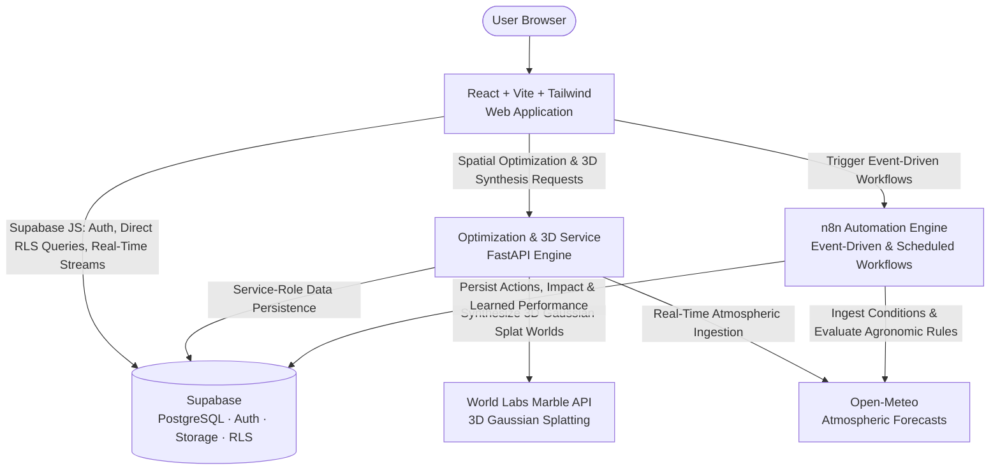
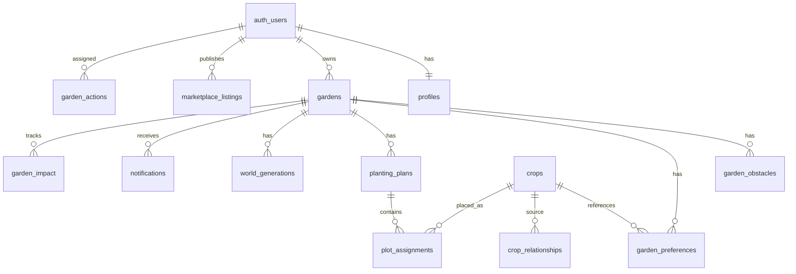

# Sprout: System Implementation & Architecture Specification

Sprout is an intelligent gardening platform that transforms any yard, balcony, raised bed, or community plot into an optimized, season-long food garden with succession planting.

This document serves as the comprehensive engineering specification for Sprout, covering system architecture, algorithmic optimization, relational data modeling, 3D spatial reconstruction, and automated event workflows.

---

## 0. Architectural Highlights & System Capabilities

- **Photorealistic 3D Spatial Reconstruction**: Generates interactive 3D Gaussian-splat garden environments using the World Labs Marble API and renders them in-browser via `@sparkjsdev/spark` and Three.js with orbit controls, spatial scaling, and high-resolution 360° panorama fallback.
- **Dynamic Space-Time Optimization**: Solves 2D spatial cell allocation and 1D temporal growing intervals simultaneously. When early-season crops (e.g. spring lettuce or radishes) reach maturity and harvest, the engine automatically schedules compatible succession crops (e.g. summer bush beans) into the exact same garden cells.
- **Interactive Garden Grid & Temporal Scrubbing**: Renders garden beds on a sub-divided physical grid with real-world dimensions (cm/m), dynamic cell overlays, color-coded crop footprints, companion planting highlights, and an interactive date slider for timeline playback.
- **Automated Agronomic Care & Notification Engine**: An event-driven and scheduled workflow engine (n8n + Supabase) evaluates real-time atmospheric conditions, triggers localized care actions and frost alerts, executes dynamic crop replanning upon failure events, and continuously trains a closed-loop agronomic performance model.
- **Yield & Economic Modeling**: Computes data-driven harvest weight ranges (kg) and grocery cost offsets based on plant spacing footprint, agronomic yield distributions, and regional retail pricing.
- **Peer-to-Peer Produce & Seed Marketplace**: Connects local growers to exchange surplus harvest and seeds, complete with dynamic localized search, real-time reservations, and automated seller notifications.
- **End-to-End Type Safety & Data Integrity**: Strict validation across frontend TypeScript interfaces, Pydantic data schemas, and PostgreSQL Row-Level Security policies.

---

## 1. Executive Summary

Sprout takes a garden's physical dimensions, sunlight exposure level, and desired crop priorities, then produces an optimized, multi-season succession planting plan. The platform maximizes spatial and temporal soil utilization by dynamically calculating planting windows, days to maturity, harvest durations, root footprints, companion compatibility, and shade penalties.

The system architecture combines a responsive React frontend, a high-performance spatial-temporal optimization engine, managed PostgreSQL persistence and authentication via Supabase, real-time 3D Gaussian-splat rendering via World Labs Marble, and an event-driven automation engine via n8n.

---

## 2. System Architecture & Data Flow



### Core Communication Pathways:
1. **Direct Authenticated Queries**: The frontend queries Supabase directly for authentication, garden management, spatial plan visualization, and notification streams under PostgreSQL Row-Level Security (RLS).
2. **Computational Engine**: The frontend invokes the optimization service for multi-variable space-time plan generation, yield projections, and 3D Gaussian-splat synthesis.
3. **Event-Driven Automation**: Lifecycle events (weather updates, crop losses, harvest logging, seed marketplace requests) trigger n8n webhooks that execute multi-step logic and persist state updates directly into Supabase.

---

## 3. Technology Responsibilities

| Subsystem / Concern | Technology | Responsibility & Implementation |
|---|---|---|
| **Identity & Access** | Supabase Auth | User registration, password authentication, session tokens, password recovery |
| **Data Persistence** | Supabase PostgreSQL | Relational data persistence, foreign key cascading, database triggers, indexes |
| **Access Control** | PostgreSQL RLS | Row-level security policies enforcing user isolation across all tables |
| **Asset Storage** | Supabase Storage | Private `garden-images` bucket with user-scoped storage policies |
| **Space-Time Optimization** | Python / FastAPI (`services/optimizer.py`) | 2-stage heuristic solving 2D grid placement and 1D temporal succession intervals |
| **Yield & Economic Modeling** | Python / FastAPI (`services/estimates.py`) | Agronomic yield modeling and regional grocery value estimations |
| **Atmospheric Intelligence** | Open-Meteo API & Service | Real-time weather forecasting and microclimate ingestion |
| **3D Spatial Visualization** | World Labs Marble API + `@sparkjsdev/spark` | Image-conditioned 3D Gaussian-splat synthesis and WebGL in-browser rendering |
| **Workflow Automation** | n8n Engine | Event-driven webhooks and daily scheduled agronomic workflows |
| **Frontend Web App** | React 18 + TypeScript + Tailwind CSS | Responsive UI, interactive spatial grid, timeline slider, 3D viewer, marketplace |

---

## 4. End-to-End User Journey

1. **Onboarding & Authentication**: User registers with email and password via Supabase Auth. A PostgreSQL database trigger automatically creates an associated `profiles` record.
2. **Garden Configuration**: The user defines garden properties (name, location/city, dimensions in meters, sunlight exposure) and uploads an image of the physical garden area to Supabase Storage.
3. **Crop Selection & Prioritization**: The user selects desired vegetables and herbs from the curated agronomic catalog, designating crops as `must_have`, `preferred`, or `optional`.
4. **Plan Generation**: The optimization engine analyzes garden dimensions, sunlight requirements, root spacing footprints, crop maturity cycles, and companion affinities to construct a multi-season succession plan in a single request.
5. **Interactive Plan Exploration**: The user inspects the garden bed layout on a cell grid (30 cm grid cells) with color-coded footprints and companion highlights. Dragging the timeline slider demonstrates dynamic succession handoffs across the season.
6. **Photorealistic 3D World Exploration**: The user launches the 3D preview. World Labs synthesizes a photorealistic 3D Gaussian-splat world conditioned on the garden photo and planned crop configuration, allowing interactive orbit navigation in-browser.
7. **Actionable Care & Notifications**: The automation engine continuously evaluates weather conditions and planting dates, generating timely watering alerts, frost protections, and planting tasks.
8. **Harvest & Community Marketplace**: The user logs harvest yields to track cumulative environmental metrics, lists surplus produce or seeds on the marketplace, and reserves offerings from local growers.

---

## 5. Repository Structure

```text
sprout/
├── frontend/
│   ├── src/
│   │   ├── components/          # AppHeader, Layout, buttons, modal dialogs
│   │   ├── pages/              # Landing, Login, Signup, Dashboard, Wizard, Crops, Plan, Marketplace
│   │   ├── features/
│   │   │   ├── auth/           # Session context, authentication guards, user forms
│   │   │   ├── gardens/        # Garden creation wizard, dimension validation, garden API
│   │   │   ├── crops/          # Crop catalog filtering, selection state, priority tagging
│   │   │   ├── plans/          # Spatial grid, timeline slider, date filtering, succession links
│   │   │   ├── notifications/  # Notification panel, priority filtering, mark-read actions
│   │   │   ├── marketplace/    # Browse listings, dynamic creation, reservation workflow
│   │   │   └── world/          # SplatViewer (Spark/WebGL), PanoramaViewer (Three.js), asset loader
│   │   ├── lib/
│   │   │   ├── supabase.ts     # Supabase client initialization with type safety
│   │   │   └── api.ts          # Typed REST client with error normalization
│   │   └── types/              # Domain interfaces (Gardens, Crops, Plans, Assignments, Marketplace)
│   ├── index.html
│   ├── package.json
│   ├── tailwind.config.js
│   └── vite.config.ts
├── backend/
│   ├── app/
│   │   ├── main.py             # FastAPI entrypoint, CORS configuration, exception handlers
│   │   ├── config.py           # Pydantic Settings for environment management
│   │   ├── auth.py             # JWKS JWT validation with clock-skew leeway
│   │   ├── models/             # Pydantic domain models and API schemas
│   │   ├── routes/             # REST endpoints (gardens, crops, plans, weather, world, marketplace)
│   │   ├── services/           # Space-time optimizer, yield estimates, weather, World Labs Marble
│   │   └── data/               # Curated agronomic dataset (crop_seed_data.json)
│   ├── tests/                  # Automated pytest suite (optimizer invariants, estimates, auth)
│   └── requirements.txt
├── supabase/
│   ├── migrations/             # SQL schema migrations (0001_initial_schema, 0002_marketplace)
│   ├── seed.sql                # Agronomic crop dataset and companion relationships
│   └── rls-policies.sql        # Row-Level Security policies and storage bucket rules
├── n8n/
│   └── weather-workflow.json   # Exported workflow definitions for automated care
└── docs/
    └── backend.md              # Authoritative reference for automation workflows and schemas
```

---

## 6. Authentication & User Management

Supabase Auth manages credentials securely with industry-standard bcrypt hashing and cryptographic JWT issuance.

### Dynamic Profile Creation Trigger
A PostgreSQL trigger automatically creates a `profiles` entry whenever a new user registers:

```sql
create function public.handle_new_user()
returns trigger language plpgsql security definer as $$
begin
  insert into public.profiles (id, display_name)
  values (new.id, coalesce(new.raw_user_meta_data->>'display_name', split_part(new.email,'@',1)));
  return new;
end; $$;

create trigger on_auth_user_created
  after insert on auth.users
  for each row execute procedure public.handle_new_user();
```

### JWT Verification (`app/auth.py`)
All authenticated API endpoints validate the Supabase bearer token against Supabase JWKS public keys (`SUPABASE_JWKS_URL`). Token verification incorporates clock-skew leeway to handle minor client-server time differences seamlessly.

---

## 7. Relational Database Schema



### Table Definitions:

- **`profiles`**: `id` (FK `auth.users.id`, PK), `display_name`, `city`, `created_at`.
- **`gardens`**: `id`, `user_id`, `name`, `city`, `latitude`, `longitude`, `width_m`, `length_m`, `sunlight_level`, `image_path`, `created_at`, `updated_at`.
- **`garden_obstacles`**: `id`, `garden_id`, `x`, `y`, `width_cells`, `height_cells`.
- **`crops`**: `id`, `name`, `spacing_cm`, `days_to_maturity`, `harvest_duration_days`, `sunlight_requirement`, `height_cm`, `minimum_yield_kg`, `maximum_yield_kg`, `estimated_price_per_kg`, `planting_month_start`, `planting_month_end`, `difficulty`.
- **`crop_relationships`**: `id`, `crop_id`, `related_crop_id`, `relationship_type` (`companion` | `conflict`), `score`.
- **`garden_preferences`**: `id`, `garden_id`, `crop_id`, `priority` (`must_have` | `preferred` | `optional`).
- **`planting_plans`**: `id`, `garden_id`, `status`, `estimated_minimum_yield_kg`, `estimated_maximum_yield_kg`, `estimated_minimum_savings`, `estimated_maximum_savings`, `space_utilization`, `created_at`.
- **`plot_assignments`**: `id`, `plan_id`, `crop_id`, `x`, `y`, `width_cells`, `height_cells`, `plant_date`, `harvest_start`, `harvest_end`, `plant_count`, `estimated_minimum_yield_kg`, `estimated_maximum_yield_kg`, `successor_assignment_id` (self-FK), `explanation`.
- **`notifications`**: `id`, `user_id`, `garden_id`, `type`, `title`, `message`, `is_read`, `created_at`.
- **`world_generations`**: `id`, `garden_id`, `operation_id`, `world_id`, `status`, `result_url`, `error_message`, `created_at`, `updated_at`.
- **`marketplace_listings`**: `id`, `user_id`, `crop_id` (nullable FK to `crops`), `title`, `exchange_type` (`sell` | `trade` | `free`), `price_per_unit`, `quantity`, `unit`, `city`, `description`, `status` (`published` | `reserved` | `completed` | `archived`), `reserved_by` (FK to `auth.users`), `reserved_at`, `created_at`, `updated_at`.
- **`garden_actions`**: `id`, `garden_id`, `user_id`, `title`, `description`, `priority`, `created_at`.
- **`garden_impact`**: `id`, `garden_id`, `total_kg_yield`, `water_saved_liters`, `carbon_offset_kg`, `updated_at`.
- **`seed_matches`**: `id`, `garden_id`, `user_id`, `listing_id`, `match_score`, `created_at`.
- **`garden_outcome_events`**: `id`, `garden_id`, `crop_id`, `sunlight_level`, `planting_month`, `yield_kg`, `success`, `created_at`.
- **`crop_performance`**: `id`, `crop_id`, `condition_key`, `sample_count`, `success_rate`, `avg_yield_kg`, `updated_at`.

---

## 8. Row-Level Security (RLS)

Strict PostgreSQL Row-Level Security policies ensure complete user isolation.

```sql
-- Gardens ownership policy
alter table public.gardens enable row level security;

create policy "Users can manage their own gardens" on public.gardens
  for all using (user_id = auth.uid()) with check (user_id = auth.uid());

-- Child table access policy via parent garden
create policy "Plans accessible via owning garden" on public.planting_plans
  for all using (
    exists (
      select 1 from public.gardens g
      where g.id = planting_plans.garden_id and g.user_id = auth.uid()
    )
  );

-- Marketplace listings visibility policy
alter table public.marketplace_listings enable row level security;

create policy "Public can view published marketplace listings" on public.marketplace_listings
  for select using (status = 'published');

create policy "Users can manage their own listings" on public.marketplace_listings
  for all using (user_id = auth.uid()) with check (user_id = auth.uid());
```

---

## 9. Supabase Storage Architecture

- **Bucket**: `garden-images` (private).
- **Access Rule**: Authenticated users can upload and retrieve images located under their own user path (`{user_id}/{garden_id}/...`).
- **Validation**: Accepts `image/jpeg`, `image/png`, and `image/webp` up to 10 MB.
- **Processing**: Uploaded imagery is streamed directly to World Labs Marble for 3D Gaussian-splat scene synthesis.

---

## 10. API & Webhook Specifications

### REST Endpoints (`/api`)

- **`POST /api/gardens`** — Creates a garden entity with spatial dimensions and sunlight properties.
- **`GET /api/gardens`** — Lists all gardens owned by the authenticated user.
- **`GET /api/gardens/{id}`** — Retrieves details for a specific garden.
- **`PATCH /api/gardens/{id}`** — Updates garden attributes.
- **`DELETE /api/gardens/{id}`** — Deletes a garden and cascades related plans, obstacles, and generations.
- **`POST /api/gardens/{id}/obstacles`** — Configures spatial obstacle regions (e.g. posts, pathways).
- **`GET /api/crops`** — Retrieves the complete agronomic crop dataset with spacing, growth, and sunlight parameters.
- **`POST /api/gardens/{id}/plans/generate`** — Executes the space-time optimization algorithm and returns the optimized plan and plot assignments.
- **`GET /api/plans/{id}`** — Retrieves a persisted planting plan with all assignments.
- **`GET /api/gardens/{id}/weather`** — Ingests live atmospheric forecasts for the garden's coordinates.
- **`POST /api/gardens/{id}/world`** — Initiates 3D Gaussian-splat reconstruction via World Labs Marble.
- **`GET /api/gardens/{id}/world/status`** — Polls 3D world generation progress (`pending` | `processing` | `ready` | `failed`).
- **`GET /api/gardens/{id}/world/assets`** — Retrieves Gaussian-splat URL, panorama URL, and metric scale metadata.
- **`GET /api/gardens/{id}/world/pano`** — Proxies the high-resolution 360° equirectangular panorama texture.
- **`POST /api/marketplace/listings`** — Creates a surplus produce or seed listing.
- **`GET /api/marketplace/listings`** — Queries published community listings with dynamic filtering.
- **`POST /api/marketplace/listings/{id}/reserve`** — Reserves an active listing and alerts the seller.
- **`POST /api/webhooks/n8n/weather-notification`** — Ingests automated alerts from n8n verified via `X-N8N-Secret`.

---

## 11. Space-Time Optimization Algorithm

The core optimization engine solves spatial 2D allocation and temporal 1D interval scheduling concurrently.

### 1. Spatial & Temporal Collision Model

```text
function rects_overlap(a, b):
    return not (a.x + a.w <= b.x or b.x + b.w <= a.x
             or a.y + a.h <= b.y or b.y + b.h <= a.y)

function intervals_overlap(a_start, a_end, b_start, b_end):
    return a_start <= b_end and b_start <= a_end
```

A placement candidate is valid if and only if no existing assignment in the same spatial cells overlaps in its growing date interval `[plant_date, removal_date]`.

### 2. Two-Stage Optimization Pipeline

- **Stage 1 (Must-Have Placement)**: Sorts mandatory crops by area footprint and growing duration. Allocates contiguous spatial regions that satisfy sunlight and boundary constraints.
- **Stage 2 (Space Filling & Succession Linking)**: Scans the space-time continuum for available windows `(region, [start_date, end_date])`. Evaluates candidate crops using a multi-objective scoring function:

$$\text{Score} = w_{\text{yield}} \cdot Y + w_{\text{pref}} \cdot P + w_{\text{compat}} \cdot C + w_{\text{util}} \cdot U + w_{\text{spread}} \cdot S - w_{\text{shade}} \cdot H$$

Where:
- $Y$ = normalized expected yield.
- $P$ = user priority weight (`must_have` > `preferred` > `optional`).
- $C$ = companion plant affinity bonus minus conflict penalty.
- $U$ = spatial and temporal utilization gain.
- $S$ = seasonal harvest spread bonus.
- $H$ = shade penalty computed against southward neighbor crop heights.

When an allocation immediately succeeds a cleared crop in the same cells, a succession link (`successor_assignment_id`) is established.

---

## 12. Dynamic Succession Planting Logic

Succession planting turns static layouts into high-efficiency continuous harvests. When an early crop reaches its removal date, the engine identifies successor candidates that can mature within the remaining seasonal duration:

```text
function link_succession(predecessor, region, grid):
    free_from = predecessor.removal_date + 1 day
    for crop in successor_candidates(region, season_remaining_after(free_from)):
        if crop.days_to_maturity + crop.harvest_duration <= days_left_in_season(free_from):
            if fits(region, crop) and valid_window(crop, free_from):
                place crop at region with plant_date = free_from
                predecessor.successor_assignment_id = successor.id
                return successor
    return null
```

---

## 13. Yield & Economic Savings Estimation

Yield and economic value are modeled as empirical distribution ranges:

$$\text{plant\_count} = \frac{\text{cells\_area}}{\text{footprint\_per\_plant}}$$

$$\text{yield}_{\text{min}} = \text{plant\_count} \times \text{crop.minimum\_yield\_kg\_per\_plant}$$
$$\text{yield}_{\text{max}} = \text{plant\_count} \times \text{crop.maximum\_yield\_kg\_per\_plant}$$

$$\text{savings}_{\text{min}} = \text{yield}_{\text{min}} \times \text{crop.estimated\_price\_per\_kg}$$
$$\text{savings}_{\text{max}} = \text{yield}_{\text{max}} \times \text{crop.estimated\_price\_per\_kg}$$

Plan totals aggregate individual assignment ranges across the full growing season.

---

## 14. Frontend Architecture & UI Surfaces

1. **Landing Page**: Product introduction, feature overview, and direct onboarding entrypoints.
2. **Authentication**: Secure email/password login and signup with session persistence.
3. **Dashboard**: Comprehensive overview showing active gardens, aggregate environmental metrics, rapid garden creation, and the real-time notification feed.
4. **Garden Creation Wizard**: Step-by-step definition of garden name, city, dimensions, sunlight level, and site photo upload.
5. **Crop Selection**: Interactive catalog with category filters, companion recommendations, and priority assignment.
6. **Plan Visualizer**: High-resolution spatial grid displaying assigned plots, real-world metric dimensions (30 cm grid), crop legends, and the interactive date slider.
7. **3D World Explorer**: In-browser Gaussian-splat 3D viewer powered by `@sparkjsdev/spark` and Three.js with orbit controls and high-res 360° panorama fallback.
8. **Notification & Action Feed**: Real-time alerts displaying priority badges, care instructions, and mark-as-read interactions.
9. **Marketplace**: Full-featured community exchange supporting surplus produce and seed listings, geographic filtering, and instant reservation workflows.

---

## 15. World Labs Marble 3D Integration

1. The user's garden image in Supabase Storage is transferred to the World Labs Marble API as a media asset.
2. The backend synthesizes a detailed generative prompt combining garden dimensions, sunlight level, and assigned crop varieties.
3. World Labs generates an explorable 3D Gaussian-splat scene.
4. The client polls generation status and streams the resulting `.spz` Gaussian-splat model directly into the WebGL Spark renderer for interactive exploration.
5. If Gaussian splats are unsupported on legacy hardware, the system renders the high-resolution equirectangular 360° panorama via Three.js.

---

## 16. Automation & Agronomic Intelligence (n8n Engine)

### Event-Driven Workflows
- **Weather Condition Automation** (`POST /sprout/weather`): Evaluates real-time weather fluctuations and logs high-priority care alerts into `garden_actions`.
- **Dynamic Crop Replanning** (`POST /sprout/failed-crop`): Re-optimizes space-time assignments when a crop is removed early.
- **Environmental Impact Tracking** (`POST /sprout/harvest`): Accumulates water savings, carbon offsets, and food weight into `garden_impact`.
- **Smart Seed Matching** (`POST /sprout/seed-match`): Connects growers with local seed listings.
- **Seed Redistribution** (`POST /sprout/seed-redistribute`): Publishes surplus seed offerings to compatible growers.

### Scheduled Agronomic Workflows (Daily at 07:00 America/Toronto)
- **Planting Reminders**: Evaluates upcoming planting windows and alerts growers in advance.
- **Daily Action Engine**: Scans active gardens and generates prioritized daily maintenance tasks.
- **Closed-Loop Agronomic Learning**: Clusters empirical harvest data to refine localized crop success rates and yield benchmarks in `crop_performance`.

---

## 17. Production Deployment & Hosting

- **Frontend Web Application**: Hosted on Render as a high-performance static build (`frontend/`), configured with SPA rewrite routing rules (`/*` → `/index.html`).
- **Database & Identity Layer**: Managed Supabase PostgreSQL with automated backups, connection pooling, and Row-Level Security enforcement.
- **Automation Engine**: Managed n8n Cloud executing live event webhooks and daily scheduled agronomic routines.
- **Spatial Optimization Service**: Containerized FastAPI service on Render.

---

## 18. Environment Configuration

### Frontend Variables (`frontend/.env`)
- `VITE_SUPABASE_URL` — Supabase project URL.
- `VITE_SUPABASE_PUBLISHABLE_KEY` — Supabase publishable anon key.
- `VITE_N8N_WEBHOOK_BASE_URL` — Base URL for n8n workflow webhooks (`https://davidzhao0524.app.n8n.cloud/webhook/`).

### Backend Variables (`backend/.env`)
- `SUPABASE_URL` — Supabase project API URL.
- `SUPABASE_SECRET_KEY` — Supabase service-role secret key.
- `SUPABASE_JWKS_URL` — Public JWKS URL for JWT validation.
- `WORLD_LABS_API_KEY` — World Labs Marble API platform key.
- `WORLD_LABS_BASE_URL` — World Labs API base URL.
- `WORLD_LABS_MODEL` — World Labs model identifier (e.g. `marble-1.1`).
- `OPEN_METEO_BASE_URL` — Open-Meteo API endpoint.
- `N8N_WEBHOOK_SECRET` — Cryptographic shared secret for webhook authorization.
- `FRONTEND_URL` — Allowed CORS origin for frontend client requests.

---

## 19. Automated Testing & Verification

The test suite validates core system guarantees:

1. **Boundary Confinement**: Every placed crop assignment strictly resides within the physical garden bounds.
2. **Space-Time Non-Overlap**: No two crop assignments occupy the same grid cell during overlapping calendar dates.
3. **Obstacle Avoidance**: Assignments avoid designated obstacle cells.
4. **Succession Chronology**: Every successor assignment has a plant date strictly after its predecessor's removal date.
5. **Priority Ordering**: Mandatory (`must_have`) crops are placed before discretionary crops.
6. **Explanation Generation**: Unplaced crops return actionable agronomic feedback explaining spatial or sunlight constraints.
7. **Yield & Savings Distributions**: Yield and economic savings ranges satisfy $min \le max$.
8. **Authentication & Token Validation**: JWT verification validates genuine tokens with clock-skew leeway and rejects invalid signatures.
9. **Webhook Authorization**: Webhooks enforce secret key verification.

---

## 20. Future Capabilities & Expansion Roadmap

- **Computer Vision Spatial Measurement**: Automatic dimension extraction and boundary segmentation from user-submitted garden photos.
- **Microclimate & Soil Sensor Telemetry**: Integration with IoT soil moisture and temperature sensors for automated irrigation triggers.
- **Regional Frost Prediction Models**: Enhanced historical climate modeling for precision frost-date forecasting.
- **Coordinated Community Planting**: Cross-garden optimization across neighborhoods to maximize local crop diversity.
- **Multi-Year Crop Rotation**: Automated multi-season nutrient management and crop family rotation to prevent soil depletion.
